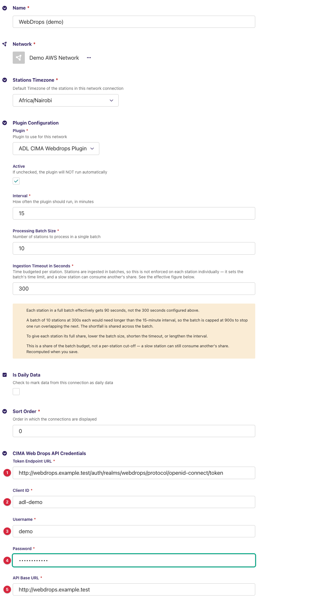
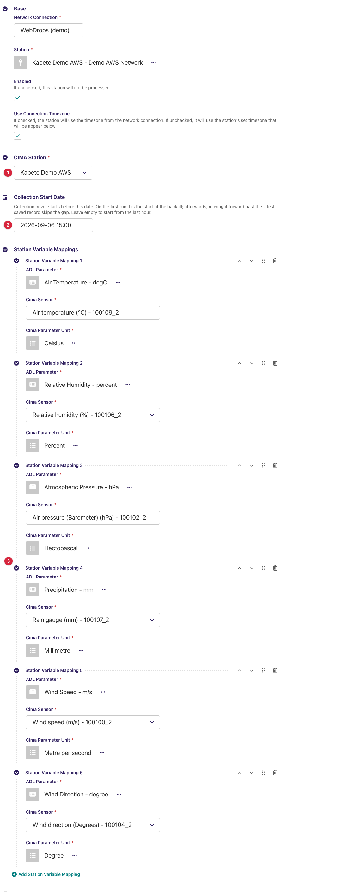
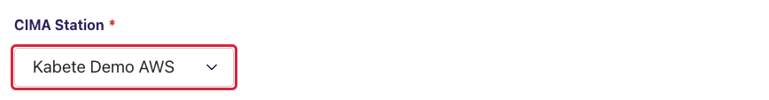
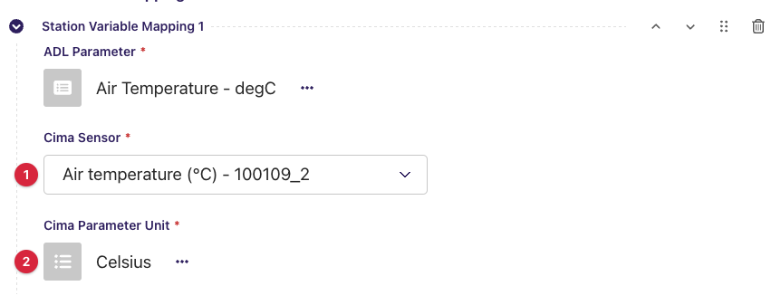
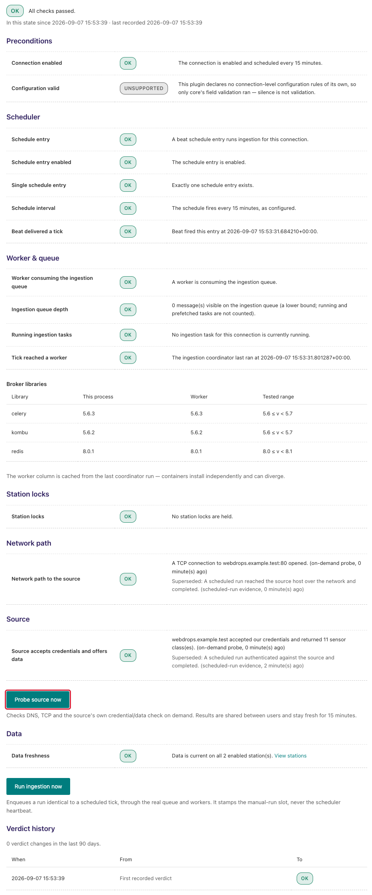
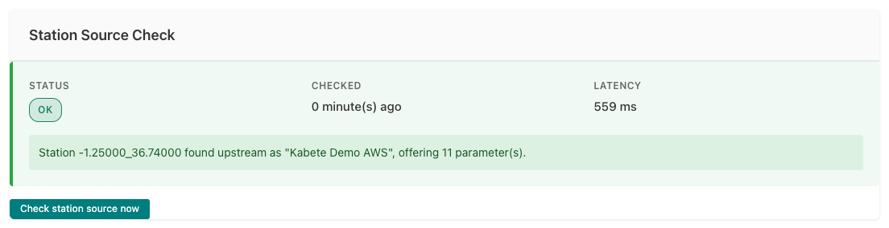

---
adl_plugin:
  name: ADL CIMA WebDrops Plugin
  connects_to: CIMA Research Foundation WebDrops API
  category: general
  choose_when: Your stations are served through a CIMA Research Foundation WebDrops (Dewetra) platform.
---
# ADL CIMA WebDrops Plugin

Collects observation data from stations published on a **CIMA Research
Foundation WebDrops** platform (the data service behind the Dewetra / myDewetra
systems deployed with several African hydro-meteorological services) through
its **REST API** and saves it into an ADL instance. This is a *pull* plugin:
on each collection cycle ADL asks the API for each mapped sensor's readings
over a time window and stores them against your ADL stations and data
parameters.

**Repository:** [adl-cimawebdrops-plugin](https://github.com/wmo-raf/adl-cimawebdrops-plugin)
**Plugin type identifier:** `adl_cimawebdrops_plugin`
**Connection model:** `CimaWebDropsConnection` · **Station link model:** `CimaWebDropsStationLink`

> **About the screenshots.** Every image in this guide is regenerated from
> `docs/screenshots.yml` against a seeded demo instance, so hostnames, station
> names, ids and readings in them are placeholders — not values to copy. The
> field tables are the reference for what to enter.

## Overview

WebDrops does not model *stations* — it models **sensors**, grouped in
**sensor classes** named in Italian (`TERMOMETRO` thermometer, `PLUVIOMETRO`
rain gauge, `IGROMETRO` hygrometer, `ANEMOMETRO` anemometer, `DIREZIONEVENTO`
wind direction, `BAROMETRO` barometer, `RADIOMETRO` radiometer, `IDROMETRO`
water level, and some forty more). Each sensor has an id, a unit, a name
and coordinates. The plugin rebuilds stations from that:

| WebDrops concept | What the plugin makes of it | Where it appears in ADL |
|---|---|---|
| A **sensor class** (`TERMOMETRO`) | Listed with an English label (*Air temperature*). | The first half of a mapping's *Cima Sensor* option. |
| All sensors sharing one **coordinate pair** (rounded to 5 decimals) | One **station**, identified by a synthetic id `<lat>_<lng>`, e.g. `17.67978_34.00370`, and named after the sensors' name. | *CIMA Station* on the station link. |
| A **sensor id** within a class at that station | One collectable **parameter**, addressed as `<class>:<sensor id>`, e.g. `TERMOMETRO:210824583_2`. | *Cima Sensor* on a variable mapping. |

Both lists are loaded from the API into the station link form, so you pick
rather than type. One collection cycle, per enabled station link: for each
variable mapping the plugin requests that sensor's readings over the run's
window (one API call per mapping), merges the readings by timestamp into
records keyed `<class>:<sensor id>`, and hands them to ADL, which stores the
mapped parameters after unit conversion.

Authentication is OAuth2 *password grant*: the plugin exchanges the
connection's client id, username and password for a bearer token at the
**token endpoint**, then calls the **API base URL** with it.

## Prerequisites

- A running ADL instance (see [Installation](https://adl-tool.readthedocs.io/en/latest/installation.html)).
- A **WebDrops API account** from CIMA (or the national service operating
  the platform): the **token endpoint URL**, the **client id**, a
  **username** and **password**, and the **API base URL**. All five go on
  the connection.
- Outbound HTTPS from the ADL host to **both** hosts — the token endpoint
  and the API base URL are often on different servers.

## Installation

Installed like any ADL plugin — see [Plugin Installation](https://adl-tool.readthedocs.io/en/latest/developer_guide/plugins/plugin_installation.html) for
all methods. The `plugins.toml` entry:

```toml
[[plugins]]
name = "ADL CIMA WebDrops Plugin"
git  = "https://github.com/wmo-raf/adl-cimawebdrops-plugin.git"
tag  = "0.3.0"
```

After rebuild/restart, confirm with `docker compose exec adl list-plugins`.

## Connection configuration

In the ADL admin, create a new **CIMA Web Drops API Connection**. Base
connection fields (name, network, plugin, processing interval, stations
timezone) are described in [Manage Connections](https://adl-tool.readthedocs.io/en/latest/user_guide/manage_connections.html).
Plugin-specific fields, under *CIMA Web Drops API Credentials*:

| Field | Required | Default | Description |
|---|---|---|---|
| Token Endpoint URL | yes | — | The OAuth2 token URL given by CIMA with the account — on Keycloak-based installations it has the shape `https://<identity host>/auth/realms/<realm>/protocol/openid-connect/token`. |
| Client ID | yes | — | The OAuth2 client id for the account (`webdrops`, or one issued to you). |
| Username | yes | — | The account's username. |
| Password | yes | — | The account's password. Sent only to the token endpoint. |
| API Base URL | yes | — | Root of the WebDrops REST API as given by CIMA, with scheme and host and without a trailing slash. The plugin appends `/sensors/classes/`, `/sensors/list/<class>/`, `/sensors/data/<class>/<id>/`. The host in this URL is what the network diagnostic dials. |



The connection has no variable mappings of its own: WebDrops sensor ids are
unique per sensor, so mappings are defined **per station link**.

## Station link configuration

For each station to collect, create a **CIMA Web Drops Station Link**:

| Field | Required | Default | Description |
|---|---|---|---|
| CIMA Station | yes | — | The station, chosen from the list the plugin builds from the API once the *Network Connection* above it is selected. Options show the station name; the stored value is the coordinate id (`17.67978_34.00370`). |
| Collection Start Date | no | empty | Collection never starts before this date, and it must be in the past. On the first run it is the start of the backfill; afterwards, moving it forward past the latest saved record skips the gap. Leave empty to start from the last hour. |
| Station Variable Mappings | yes (at least one) | — | One row per sensor to store; see below. A station with no mappings collects nothing. |



### Station variable mappings

| Field | Description |
|---|---|
| ADL Parameter | The ADL `DataParameter` the values are stored under. |
| Cima Sensor | The sensor, chosen from the list the plugin loads for the selected connection **and station**. Each option reads *English class name (unit) - sensor id*, e.g. *Air temperature (°C) - 210824583_2*; the stored value is `<class>:<sensor id>`. |
| Cima Parameter Unit | The ADL unit matching the unit shown in brackets on the sensor. ADL converts from it to the ADL parameter's unit. |

**Example:** ADL Parameter `Air Temperature` ← Cima Sensor *Air temperature
(°C) - 210824583_2* → Unit `degC`; ADL Parameter `Precipitation` ← *Rain
gauge (mm) - -1936659066_2* → Unit `mm`.

Every mapping row costs one API call per run, so map what you need.

## Admin UI added by this plugin

The plugin adds no pages, menu entries or row actions to the ADL admin. What
it adds are the two **remote-loading selects** on the station link form,
which call the WebDrops API through the connection you selected. Walk
through them in order the first time:

### Step 1 — pick the connection, then the station

Select the *Network Connection* first. The *CIMA Station* select shows a
spinner while the plugin fetches every sensor class, then every sensor of
every class, and groups them by coordinates — on a large platform this first
load takes a while; the result is cached for 24 hours. Changing the
connection clears and reloads the list.



### Step 2 — add a mapping row and pick the sensor

Under *Station Variable Mappings*, add a row. The *Cima Sensor* select loads
the sensors found at the chosen station's coordinates, one option per class
and sensor id with the unit in brackets. Note the unit, then choose the
matching *Cima Parameter Unit*. Changing the station reloads the sensor
list.



### What the selects report when something is wrong

A message above the select replaces its options when the call behind it
fails:

| Message | Meaning | What to do |
|---|---|---|
| `Network connection ID is required.` / `Select a network connection.` | No connection is selected yet. | Select the *Network Connection* first. |
| `The selected connection is not a CIMA WebDrops API Connection` | The chosen connection belongs to another plugin. | Pick a CIMA WebDrops connection. |
| `Station ID is required.` / `Select a station.` | The sensor select was opened before a station was chosen. | Choose the *CIMA Station* first. |
| An empty sensor list with no message | The station id is not in the current station list (renamed coordinates, or a stale saved link), or the station reports no sensors. | Re-select the station; run the station source check (below). |
| `HTTP error! Status: 500` (or an empty station list) | The API or token call failed — wrong credentials, wrong URL, no network. | Run *Probe source now* on the connection's Ingestion Diagnostic page; the feedback catalogue maps the result to a fix. |

## Data collection behavior

- **Window.** Each run asks for the window from the later of the latest
  saved observation plus one minute and the *Collection Start Date*, up to
  the top of the next hour. With neither, the first run starts **one hour
  ago**. **A run never asks for more than 240 hours (10 days):** the end is
  pulled back to start + 10 days when the window is longer, so a backfill
  advances ten days per run until it catches up.
- **Requests.** One call per variable mapping per run,
  `/sensors/data/<class>/<sensor id>/?from=YYYYMMDDHHMM&to=YYYYMMDDHHMM&date_as_string=true`,
  with a 60-second timeout. The API applies the window. Readings come back
  as a timeline of `YYYYMMDDHHMM` strings and a parallel list of values.
- **Timezones.** Window bounds are written in the station's local time as
  ADL computes them, and reading timestamps are read back the same way and
  stamped with the station's timezone. Set the connection's *Stations
  Timezone* to the timezone the platform reports in (WebDrops platforms
  commonly report in UTC — confirm with the operator).
- **Records.** Readings of all mapped sensors are merged by timestamp into
  one record per instant, keyed `<class>:<sensor id>`. A `null` reading is
  passed through as missing. Sensors that report at different cadences
  simply produce records with different key sets.
- **Backfill.** Set *Collection Start Date* before the first run; expect
  one run per ten days of history.
- **Caches.** Sensor classes, per-class sensor lists, the station list and
  each station's parameter list are cached for 24 hours per client id (they
  drive the selects). Readings are never cached. The bearer token is reused
  until 30 seconds before it expires.
- **Partial runs.** A run that fails after some sensors answered keeps what
  those sensors offered in its diagnostics; the failed sensor's readings are
  fetched again next run.

## Source checks / diagnostics

The plugin implements the ADL source-check contracts, so the core's
monitoring screens can tell network faults, credential faults and
configuration faults apart *for this connection specifically*. The screens
below are rendered by the ADL core, but what they display for a WebDrops
connection comes from this plugin. The core's own messages on the same
screens are catalogued in [Monitoring & Diagnostics](https://adl-tool.readthedocs.io/en/latest/user_guide/monitoring_and_diagnostics.html).

### Where check results appear

**Ingestion Diagnostic page.** From the connections list, the Health column
of your WebDrops connection links to its **Ingestion Diagnostic** page
(`/monitoring/connection/<id>/health/`). It shows a layered verdict —
network reachability of the *API Base URL* host at the bottom, then whether
the platform issued a token and answered — with a verdict history. **Probe
source now** re-dials the source immediately (at most once per minute);
**Run ingestion now** triggers a full collection cycle.



**Station Source Check panel.** Open a station link's **Inspect** page (from
the station links list, via the row's **…** menu). Alongside the Collection
Status card — which also offers **Trigger Collection Now** — the **Station
Source Check** card shows the latest station-level result: a status badge
(OK / FAILED), when it was checked, the latency, and the message produced by
this plugin.



### What each check verifies

| Check | What it verifies |
|---|---|
| Endpoint probe | DNS resolution and TCP reach of the host and port in *API Base URL*. The token endpoint's host is **not** probed here; a token-host outage shows up in the connection check's message instead. |
| Connection check | Obtains a fresh token and reads the sensor-class list (`/sensors/classes/`) — cache bypassed, 5-second timeout, no retries — claiming OK only from a parsed list, never from a bare HTTP 200. Both halves are proven at once: credentials (the token exchange) and the data API. |
| Station check | Rebuilds the station list fresh (cache bypassed) and confirms the configured coordinate id is in it, reporting the upstream name and how many parameters the station offers. |

### Feedback catalogue — messages this plugin produces

Messages name the *API Base URL* host (shown here as
`webdrops.example.org`) and paths without query strings. Find the message you
see:

| Message (example) | Status | Meaning | What to do |
|---|---|---|---|
| `webdrops.example.org accepted our credentials and returned 41 sensor class(es).` | OK | Token issued, data API readable. The count is the number of sensor classes the platform defines. | Nothing — healthy. |
| `Station 17.67978_34.00370 found upstream as "Atbara K3 Bridge", offering 6 parameter(s).` | OK | The station exists in the rebuilt list; the name and parameter count are shown so you can confirm it is the station you meant. | Check the name; 0 parameters is allowed but means nothing to map. |
| `Station 17.67978_34.00370 was found in the source's station list, offering 6 parameter(s).` | OK | As above, but the sensors at those coordinates carry no name. | Nothing. |
| `webdrops.example.org returned HTTP 401 for /sensors/classes/.` | FAILED | A credential was refused. **The 401 may come from the token endpoint** (wrong username, password or client id) even though the message names the data host and path. | Re-enter the credentials on the connection. |
| `webdrops.example.org returned HTTP 403 for /sensors/classes/.` | FAILED | Token accepted but the account may not read sensor classes. | Ask CIMA about the account's roles. |
| `webdrops.example.org returned HTTP 404 for /sensors/classes/.` | FAILED | Nothing answers at that path — *API Base URL* points to the wrong place (a missing or extra path segment). | Fix *API Base URL*. |
| `webdrops.example.org returned HTTP 5xx for /sensors/classes/.` | FAILED | The platform or the identity server errored. | Retry later. |
| `webdrops.example.org answered, but the response was not a sensor class list.` | FAILED | Something responded, but not the API: a login page, a proxy, or a token response without an access token. | Check both URLs and any proxy between ADL and the platform. |
| `webdrops.example.org could not be reached: <error>` | FAILED | Network-level failure: DNS, firewall, TLS, or timeout, on either host — the wrapped error names the URL that failed. | Check connectivity from the ADL host to both hosts. |
| `webdrops.example.org returned no stations at all, so this station could not be looked up.` | FAILED | The platform answered with no sensors, so nothing can be said about this station. | Check the account can see sensors; contact the operator. |
| `Station 17.67978_34.00370 was not found in the source's station list.` | FAILED | Positive proof the id is absent — the station's sensors were removed or moved (coordinates changed, which changes the id). | Re-select the station on the station link form. |
| `webdrops.example.org answered, but the response was not a station list.` | FAILED | A sensor listing came back in an unexpected shape. | Check the base URL; report to the operator if persistent. |
| `Could not read the station list from webdrops.example.org: <error>` | FAILED | The station check could not fetch the lists, so it proves nothing about this station. | Fix the connection-level failure first, then re-check. |

## Troubleshooting

**Connection check passes but a station collects nothing**
: Confirm the station check passes, then check each mapping's sensor is
  one the station actually offers (the parameter count in the station check
  message). A sensor that has stopped reporting yields empty timelines.

**Two ADL stations point at the same WebDrops station, or one physical site appears twice**
: Station identity is the rounded coordinate pair. Sensors of one site
  registered with slightly different coordinates split into two entries;
  sensors of different sites with identical coordinates merge. Map the
  sensor ids you need whichever entry they appear under.

**A station id stopped resolving after the operator edited the sensors**
: Moving a sensor's coordinates changes the synthetic id. Re-select the
  station on the link and re-add its mappings.

**Backfill seems stuck ten days in**
: Expected: each run covers at most 240 hours. Trigger collection
  repeatedly, or wait for the scheduled runs to catch up.

**Timestamps are offset by a fixed number of hours**
: The connection's timezone does not match the platform's reporting
  timezone. Set *Stations Timezone* accordingly.

**The station select stays empty after choosing the connection**
: The API call behind it failed, or the first load is still running (it
  fetches every sensor class). Wait, then run *Probe source now* on the
  Ingestion Diagnostic page if it stays empty.

## Compatibility

| Plugin version | Requires ADL core | Notes |
|---|---|---|
| 0.3.0 | Core with source-check contracts for full diagnostics (≥ 0.8.12) | Runs on older cores too; the source-check integration is simply inactive there. |

## Changelog

See [GitHub Releases](https://github.com/wmo-raf/adl-cimawebdrops-plugin/releases).
